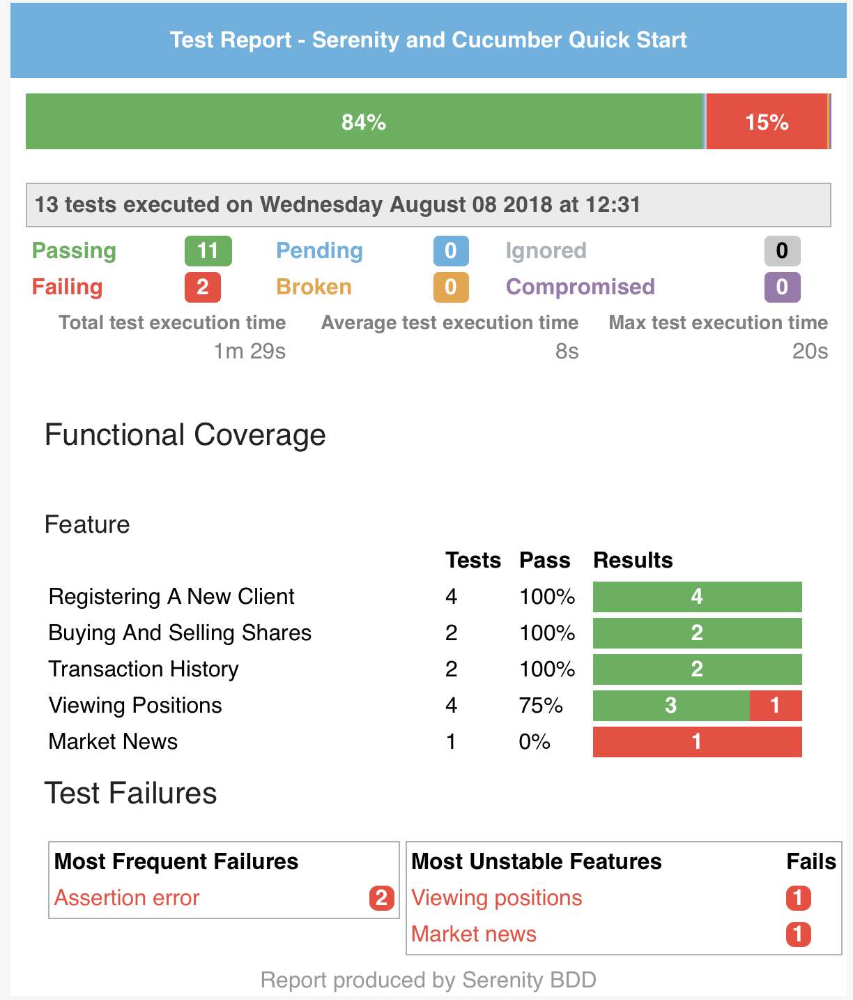
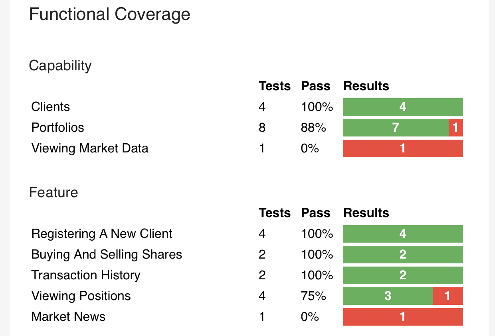
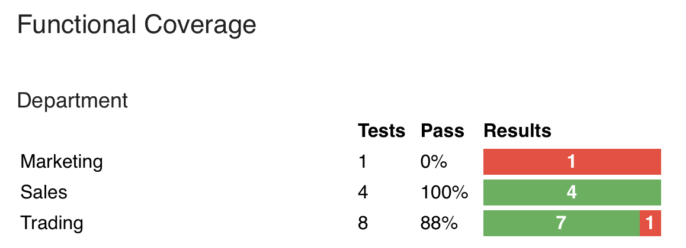

In addition to the standard HTML reports, Serenity provides additional reports for more specific usages. These include

  * Emailable HTML reports
  * Html report as single page react application

## Serenity emailable reports

Serenity BDD produces rich reports that act both as test reports and living documentation.
But often it is useful to be able to send a short summary of the test outcomes via email.

Serenity allows you to generate a single-page, self-contained HTML summary report, containing
an overview of the test results, and a configurable breakdown of the status of different areas of the application. You can see a sample of such a report here:




## Setting up Maven

These reports are configured in the Serenity Maven plugin, where you need to do two things. First, you need to add a dependency for the `serenity-emailer` module in the plugin configuration. Then, you need to tell Serenity to generate the `email` report when it performs the aggregation task.

The full configuration looks something like this:

```xml
<plugin>
    <groupId>net.serenity-bdd.maven.plugins</groupId>
    <artifactId>serenity-maven-plugin</artifactId>
    <version>${serenity.version}</version>
    <dependencies>
        <dependency> 
            <groupId>net.serenity-bdd</groupId>
            <artifactId>serenity-single-page-report</artifactId>
            <version>${serenity.version}</version>
        </dependency>
        <dependency>
            <groupId>net.serenity-bdd</groupId>
            <artifactId>serenity-navigator-report</artifactId>
            <version>${serenity.version}</version>
        </dependency>
    </dependencies>
    <configuration>
        <tags>${tags}</tags>
        <reports>single-page-html,navigator</reports>
    </configuration>
    <executions>
        <execution>
            <id>serenity-reports</id>
            <phase>post-integration-test</phase>
            <goals>
                <goal>aggregate</goal>
            </goals>
        </execution>
    </executions>
</plugin>
```
In the above snippet,
1. The `<dependency>` tags above list the dependencies on different report modules.
2. The `<reports>` tag in the `<configuration>` specifies the list of reports to generate.

If you are using Maven, you can also generate these reports directly using the `reports` goal and by passing the `serenity.reports` system property:

```bash
mvn serenity:reports -Dserenity.reports=single-page-html
```

## Setting up Gradle

If you are using Gradle, you can use the `reports` task to generate any configured extended reports. First of all, you need to add the dependencies to the extended reports you want to run in the `buildscript` section of your `build.gradle` file, e.g.

```gradle
buildscript {
    repositories {
        mavenLocal()
        jcenter()
    }
    dependencies {
        classpath "net.serenity-bdd:serenity-gradle-plugin:2.1.4"
        classpath "net.serenity-bdd:serenity-single-page-report:2.1.4"
    }
}
```

Next, you need to configure the report you want to generate in your `build.gradle` file using the `serenity` section, as shown here:

```gradle
serenity {
    reports = ["single-page-html"]
}
```

Now you can generate these reports by invoking the `reports` task:

```bash
gradle reports

> Task :reports
Generating Serenity Reports for bdd-bank to directory /Users/john/Projects/SerenityDojo/bdd-bank/target/site/serenity
PROCESSING EXTENDED REPORTS: [email]

BUILD SUCCESSFUL in 2s
1 actionable task: 1 executed
```

## Functional Coverage Reporting

The _Functional Coverage_ section lets you highlight key areas of your application.
By default, this section will list test results for each _Feature_. But you can configure the report to group results by other tags as well.

You can specify what categories should appear on this page using the `report.tagtypes` system property. For example, if want to list capabilities as well as features, you would add the following line to your `serenity.properties` file:

```
report.tagtypes=capability,feature
```

Now both capabilities and features would appear in the Functional Coverage section of the report:



### Functional coverage by tag
You can also configure functional coverage to report coverage by tags, rather than by requirements hierarchy. Suppose you are using a `@department` tag to define the key stakeholders for each feature. You could flag features to belong to different departments using tags like `@department:Trading`, `department:Sales` or `department:Marketing`.

```gherkin
@department:Trading
Feature: Buying and selling shares

  In order to make my investments grow
  As a trader
  I want to be able to buy and sell shares to make a profit
  ...
```

You could tell Serenity to produce coverage for these tags by including the following line in your `serenity.properties` file:

```
report.tagtypes=department
```

When you generate the summary report, the results will be aggregated by each tag value (Marketing, Sales and Trading), as shown here:



### Deep links

You can include a link back to your Serenity report, and links to the individual scenario results,
by setting the `serenity.report.url` property. You can do this in the `serenity.properties` file (if it is fixed),
or pass it in from the command line (if you are pointing the the reports for a specific build, for example):

```
serenity.report.url=http://my.jenkins.server:8080/job/my-project/serenity-reports/
```