# Integrating with JIRA

With Selenium BDD it is possible to create tight one and two-way integration with JIRA

### One way integration with JIRA

[JIRA](https://www.atlassian.com/software/jira) is popular issue-tracking system that is also often used for Agile projects and requirements management. Many teams using JIRA store their requirements electronically in the form of story cards and epics in JIRA

Suppose we are implementing a Frequent Flyer application for an airline. The idea is that travelers will earn points when they fly with our airline, based on the distance they fly. Travelers start out with a “Bronze” status, and can earn a better status by flying more frequently. Travelers with a higher frequent flyer status benefit from advantages such as lounge access, prioritized boarding, and so on. One of the story cards for this feature might look like the following:

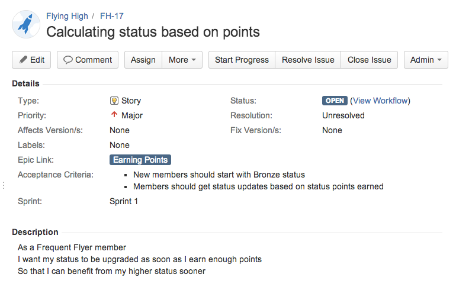

This story contains a description following one of the frequently-used formats for user story descriptions (“as a..I want..so that”). It also contains a custom “Acceptance Criteria” field, where we can write down a brief outline of the “definition of done” for this story.

These stories can be grouped into epics, and placed into sprints for project planning, as illustrated in the JIRA Agile board shown here:

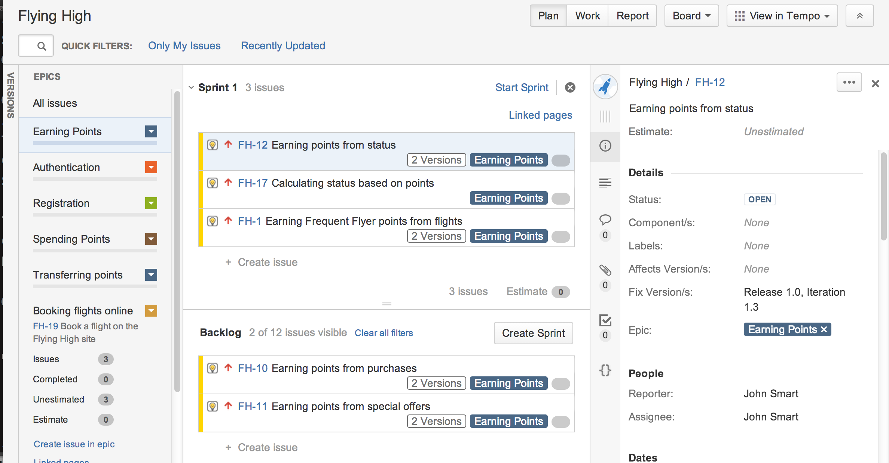

As illustrated in the story card, each of these stories has a set of acceptance criteria, which we can build into more detailed scenarios, based on concrete examples. We can then automate these scenarios using a BDD tool like JBehave.

The story in the frequent flyer storycard describes how many points members need to earn to be awarded each status level. A JBehave scenario for the story card illustrated earlier might look like this:

```
Frequent Flyer status is calculated based on points

Meta:
@issue #FH-17

Scenario: New members should start out as Bronze members
Given Jill Smith is not a Frequent Flyer member
When she registers on the Frequent Flyer program
Then she should have a status of Bronze

Scenario: Members should get status updates based on status points earned
Given a member has a status of <initialStatus>
And he has <initialStatusPoints> status points
When he earns <extraPoints> extra status points
Then he should have a status of <finalStatus>

Examples:
| initialStatus | initialStatusPoints | extraPoints | finalStatus | notes                    |
| Bronze        | 0                   | 300         | Silver      | 300 points for Silver    |
| Silver        | 0                   | 700         | Gold        | 700 points for Gold      |
| Gold          | 0                   | 1500        | Platinum    | 1500 points for Platinum |
```

Serenity lets you associate JBehave stories or JUnit tests with a JIRA card using the @issue meta tag (illustrated above), or the equivalent @Issue annotation in JUnit. At the most basic level, this will generate links back to the corresponding JIRA cards in your test reports, as illustrated here:

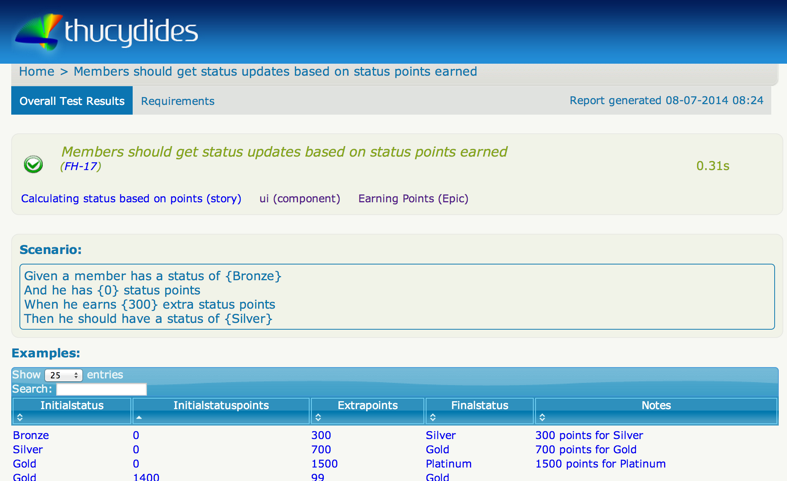

For this to work, Serenity needs to know where your JIRA server. The simplest way to do this is to define the following properties in a file called serenity.properties in your project root directory:

```
jira.url=https://myserver.atlassian.net
jira.project=FH
jira.username=jirauser
jira.password=t0psecret
```

You can also set these properties up in your Maven pom.xml file or pass them in as system properties.

#### Feature Coverage
But test results only report part of the picture. If you are using JIRA to store your stories and epics, you can use these to keep track of progress. But how do you know what automated acceptance tests have been implemented for your stories and epics, and, equally importantly, how do you know which stories or epics have no automated acceptance tests? In agile terms, a story cannot be declared “done” until the automated acceptance tests pass. Furthermore, we need to be confident not only that the tests exist, but that they test the right requirements, and that they test them sufficiently well.

We call this idea of measuring the number (and quality) of the acceptance tests for each of the features we want to build “feature coverage”. Serenity can provide feature coverage reporting in addition to the more conventional test results. If you are using JIRA, you will need to add serenity-jira-requirements-provider to the dependencies section of your pom.xml file:
```
<dependencies>
    ...
    <dependency>
        <groupId>net.serenity.plugins.jira</groupId>
        <artifactId>serenity-jira-requirements-provider</artifactId>
        <version>xxx</version>
    </dependency>
</dependencies>
```
The actual version number might be different for you – always take a look at [Maven Central](http://search.maven.org/#search%7Cga%7C1%7Cthucydides) to know what the latest version is.

You will also need to add this dependency to the Serenity reporting plugin configuration:

```
<build>
    ...
    <plugins>
        ...
        <plugin>
            <groupId>net.serenity.maven.plugins</groupId>
            <artifactId>maven-serenity-plugin</artifactId>
            <version>xxx</version>
            <executions>
                <execution>
                    <id>serenity-reports</id>
                    <phase>post-integration-test</phase>
                    <goals>
                        <goal>aggregate</goal>
                    </goals>
                </execution>
            </executions>
            <dependencies>
                <dependency>
                    <groupId>net.serenity.plugins.jira</groupId>
                    <artifactId>serenity-jira-requirements-provider</artifactId>
                    <version>xxx</version>
                </dependency>
            </dependencies>
        </plugin>
    </plugins>
</build>
```

Now, when you run the tests, Serenity will query JIRA to determine the epics and stories that you have defined and list them on the Requirements page. This page gives you an overview of how many requirements (epics and stories) have passing tests (green), how many have failing (red) or broken (orange) tests, and how many have no tests at all (blue):

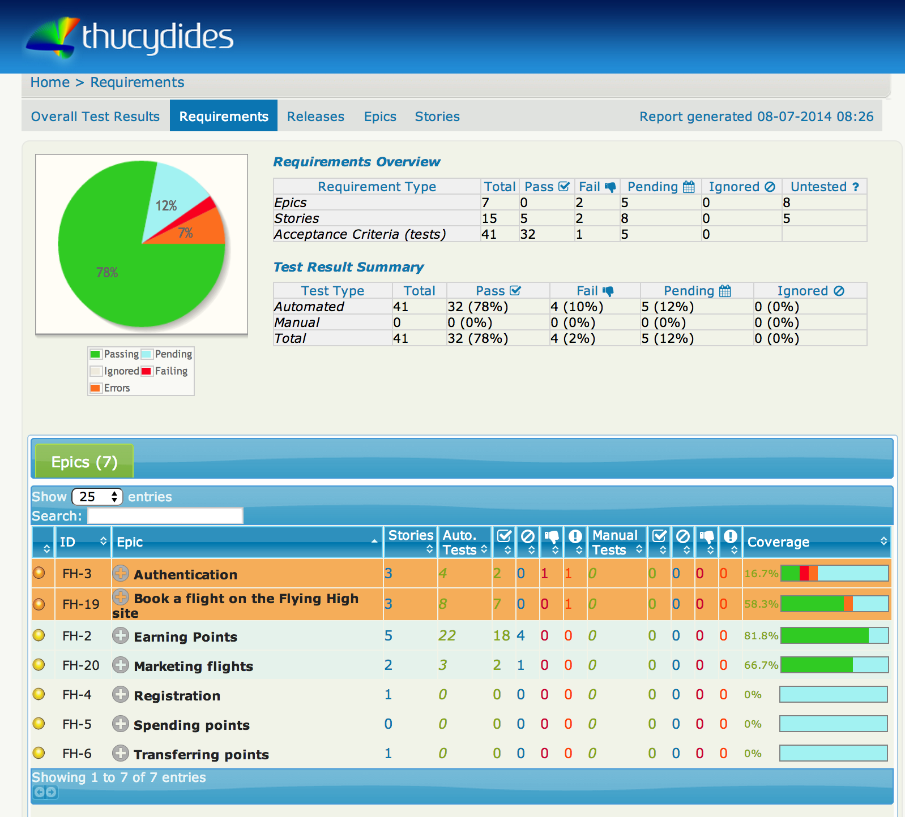

If you click on an epic, you can see the stories defined for the epic, including an indicator (in the “Coverage” column) of how well each story has been tested.

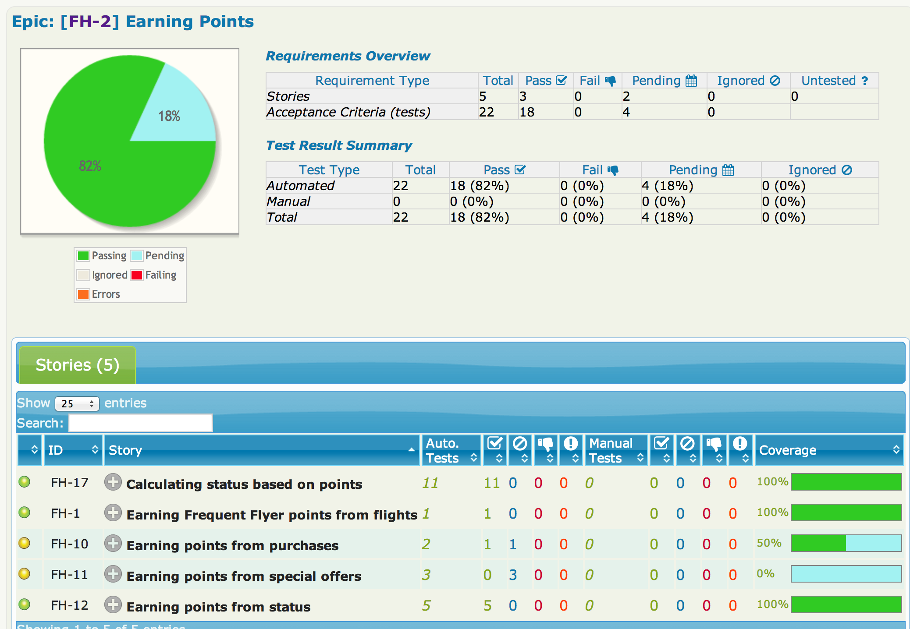

From here, you may want to drill down into the details about a given story, including what acceptance tests have been defined for this story, and whether they ran successfully:

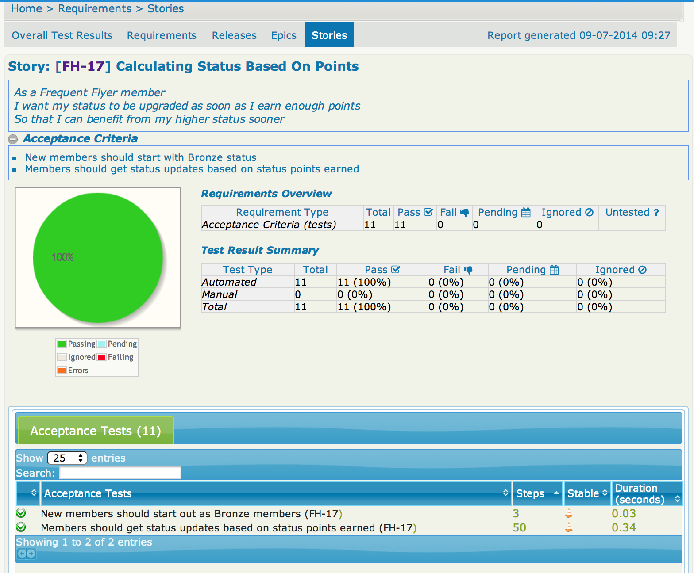
Both JIRA and the JIRA-Serenity integration are quite flexible. We saw earlier that we had configured a custom “Acceptance Criteria” field in our JIRA stories. We have displayed this custom field in the report shown above by including it in the serenity.properties file, like this:

```
jira.custom.field.1=Acceptance Criteria
```

Serenity reads the narrative text appearing in this report (“As a frequent flyer…”) from the Description field of the corresponding JIRA card. We can override this behavior and get Serenity to read this value from a different custom field using the `jira.custom.narrative.field` property. For example, some teams use a custom field called “User Story” to store the narrative text, instead of the Description field. We could get Serenity to use this field as follows:

```
jira.custom.narrative.field=User Story
```

### Two way integration with JIRA

#### Links from JIRA to Serenity
The simplest form of two-way integration between Serenity and JIRA is to get Serenity to insert a comment containing links to the Serenity test reports for each related issue card. To get this to work, you need to tell Serenity where the reports live. One way to do this is to add a property called serenity.public.url to your serenity.properties file with the address of the serenity reports.

```
serenity.public.url=http://buildserver.myorg.com/latest/serenity/report
```

This will tell Serenity that you not only want links from the Serenity reports to JIRA, but you also want to include links in the JIRA cards back to the corresponding Serenity reports. When this property is defined, Serenity will add a comment like the following to any issues associated with the executed tests:

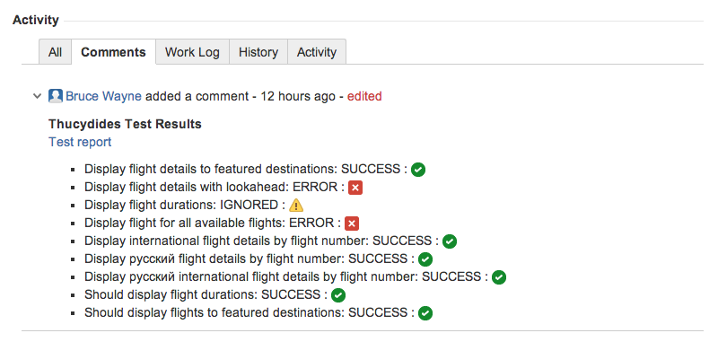

The `serenity.public.url` will typically point to a local web server where you deploy your reports, or to a path within your CI server. For example, you could publish the Serenity reports on Jenkins using the [Jenkins HTML Publisher Plugin](https://wiki.jenkins-ci.org/display/JENKINS/HTML+Publisher+Plugin), and then add a line like the following to your serenity.properties file:

```
serenity.public.url=http://jenkins.myorg.com/job/myproject-acceptance-tests/Serenity_Report/
```

If you do not want Serenity to update the JIRA issues for a particular run (e.g. when running your tests locally), you can also set `serenity.skip.jira.updates` to true, e.g.

```
serenity.skip.jira.updates=true
```

This will simply write the relevant issue numbers to the log rather than trying to connect to JIRA.

#### Updating JIRA issue states

You can also configure the plugin to update the status of JIRA issues. This is deactivated by default: to use this option, you need to set the `serenity.jira.workflow.active` option to true, e.g.

```
serenity.jira.workflow.active=true
```

The default configuration will work with the default JIRA workflow: open or in progress issues associated with successful tests will be resolved, and closed or resolved issues associated with failing tests will be reopened. If you are using a customized workflow, or want to modify the way the transitions work, you can write your own workflow configuration. Workflow configuration uses a simple Groovy DSL. The following is an example of the configuration file used for the default workflow:

```
when 'Open', {
    'success' should: 'Resolve Issue'
}

when 'Reopened', {
    'success' should: 'Resolve Issue'
}

when 'Resolved', {
    'failure' should: 'Reopen Issue'
}

when 'In Progress', {
    'success' should: ['Stop Progress','Resolve Issue']
}

when 'Closed', {
    'failure' should: 'Reopen Issue'
}
```

You can write your own configuration file and place it on the classpath of your test project (e.g. in serenity's directory). Then you can override the default configuration by using `serenity.jira.workflow` property, e.g.

```
serenity.jira.workflow=my-workflow.groovy
```

Alternatively, you can simply create a file called jira-workflow.groovy and place it somewhere on your classpath (e.g. in the src/test/resources directory). Serenity will then use this workflow. In both these cases, you don’t need to explicitly set the `serenity.jira.workflow.active` property.

#### Release management

In JIRA, you can organize your project releases into versions, as illustrated here:

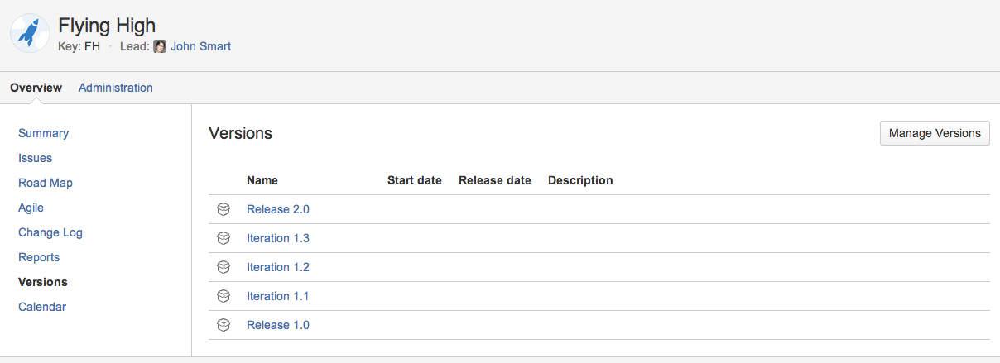

You can and assign cards to one or more versions using the `Fix Version/s` field:

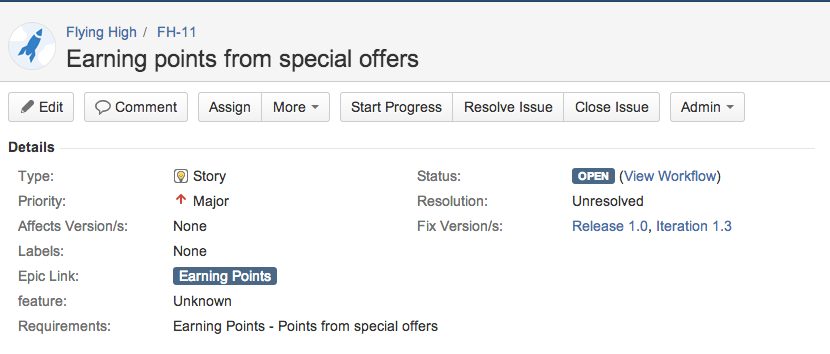

By default, Serenity will read version details from the Releases in JIRA. Test outcomes will be associated with a particular version using the “Fixed versions” field. The *Releases* tab gives you a run-down of the different planned versions, and how well they have been tested so far:

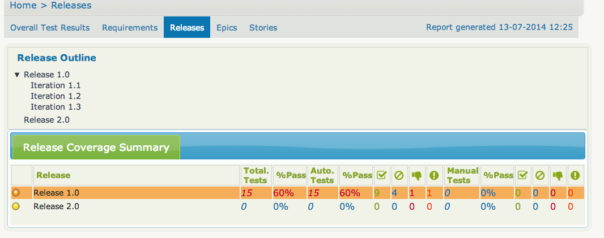

JIRA uses a flat version structure – you can’t have for example releases that are made up of a number of sprints. Serenity lets you organize these in a hierarchical structure based on a simple naming convention. By default, Serenity uses “release” as the highest level release, and either “iteration” or “sprint” as the second level. For example, suppose you have the following list of versions in JIRA – Release 1 – Iteration 1.1 – Iteration 1.2 – Release 2 – Release 3

This will produce Release reports for Release 1, Release 2, and Release 3, with Iteration 1.2 and Iteration 1.2 appearing underneath Release 1. The reports will contain the list of requirements and test outcomes associated with each release. You can drill down into any of the releases to see details about that particular release.

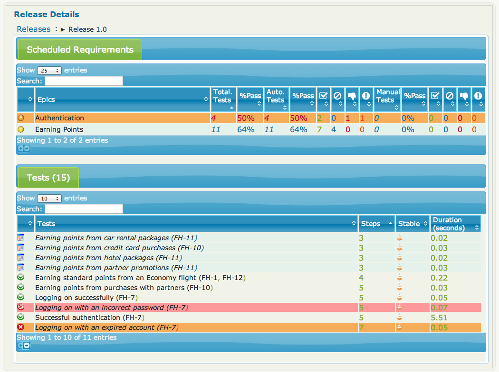

You can also customize the names of the types of releases using the serenity.release.types property, e.g.

```
serenity.release.types=milestone, release, version
```
