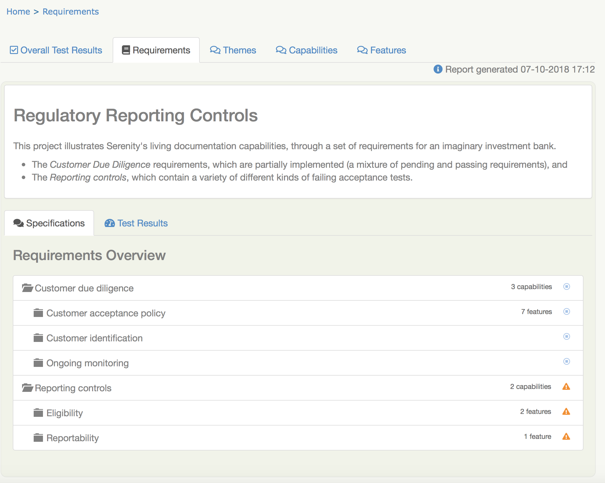
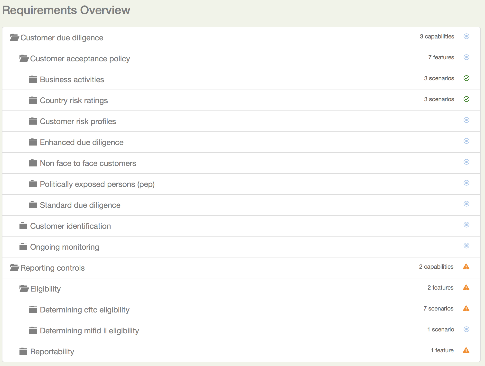
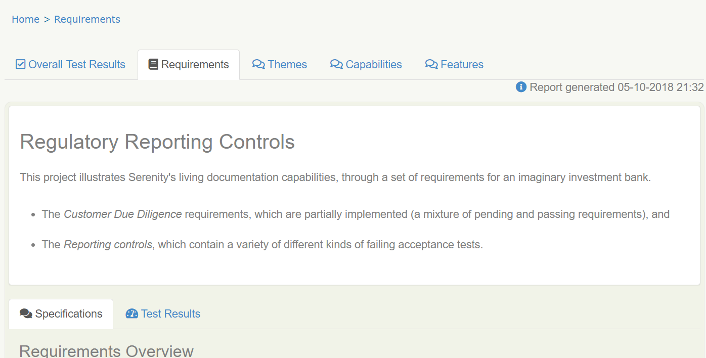
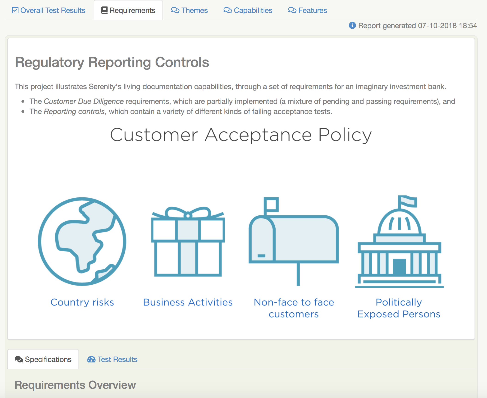
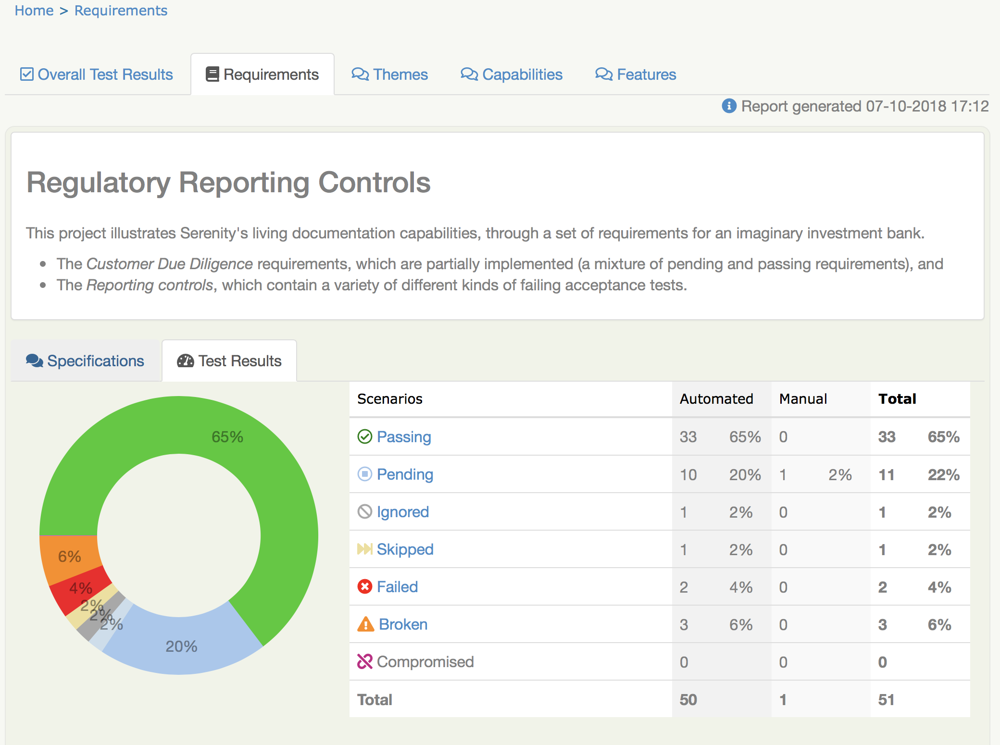
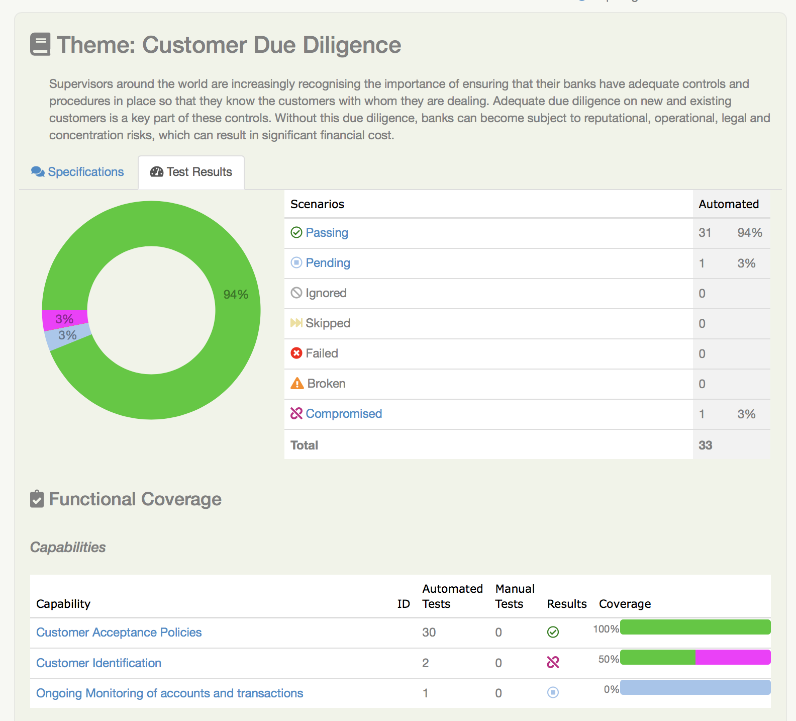
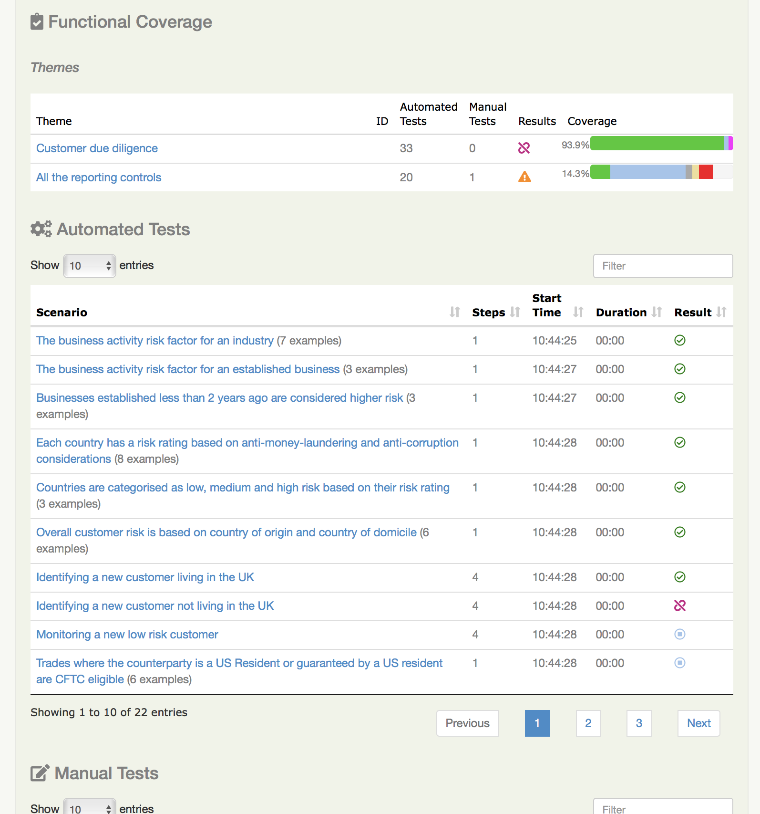
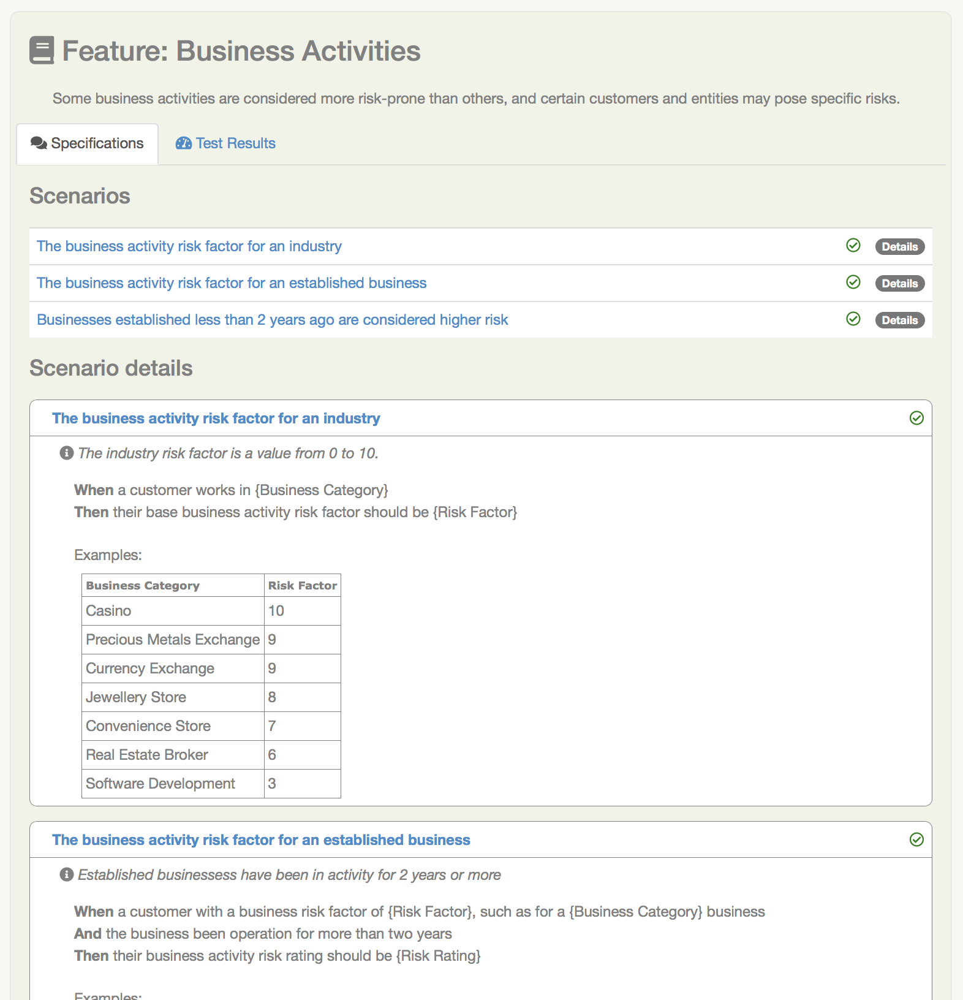
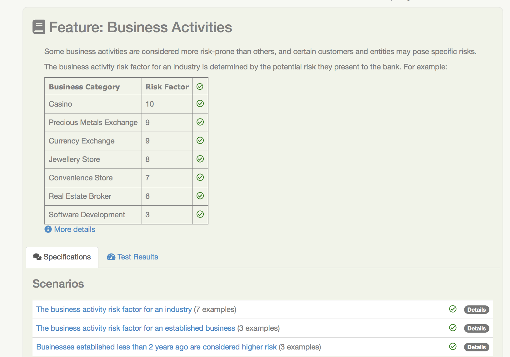
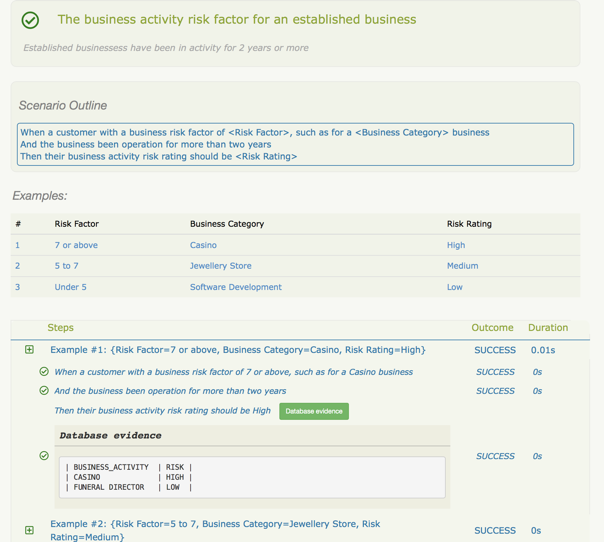

## What is Living documentation?

Serenity BDD is more than a library that generates test reports. That is, while you can use Serenity BDD to produce great test reports just fine, the real goal of Serenity BDD is to produce _living documentation_ for your product.

But what do we mean by "living documentation"? Living Documentation is a concept that comes from the world of Behavior Driven Development. It is closely related to the idea of Executable Specifications. Living documentation is, as the name suggests, both _documentation_, and _living_.

* It is _documentation_, because it describes how an application works, and what business rules it applies, in a way that normal users can understand. Well written living documentation can be used by new team members to understand what a product does, and how it works. It can be handed over to a maintenance team when the application goes into production, or it can be used as evidence for auditors to show that the application respects the relevant rules and regulations.
* It is _living_, because it is generated by the automated test suite, and is therefore by definition it is always up-to-date.

In a Serenity BDD report, you can find the Living Documentation in the `Requirements` tab.

#### Requirements Tab {#fig-requirements-tab}

 

## Living Documentation and Test Reporting

Living Documentation should not be confused with conventional test reporting. There are a number of important differences, and understanding these differences makes it easier to write good quality living documentation.

### Timing

Conventional test reports are designed and generated fairly late in the development process, typically once features have been delivered and the automated tests written. Testers will often start preparatory work on test cases once the specifications or user stories are finalised, but test reports are still an activity that happens later rather than earlier in the development process.

For a team practicing BDD, on the other hand, the work on Living Documentation starts much earlier. Teams practicing BDD will work together with product owners to define acceptance criteria for the stories to be developed, and these acceptance criteria will form the basis for the automated acceptance tests _and_ for the living documentation that is generated with each build.

### Authors

Test Reports are the responsibility of QA; testers are usually the ones who design the report structure (if any design is done) and generate the test reports.

Living Documentation, on the other hand, is written collaboratively by many different actors: BAs, developers, testers and product owners all play key roles in the BDD requirements discovery process, and help, together, to express the business needs in a form that can be executed as automated acceptance tests.

### Audience and Language

Testers are also the primary consumers of test reports. In many projects, other team members will only ever see test report summaries or overviews.

Living Documentation is for the whole team, including product owners, stakeholders and users involved in the project. It describes what the application should do before a feature is implemented (in the form of pending scenarios), and demonstrates (and gives evidence) that the implemented feature behaves as expected (in the form of passing scenarios). For this reason, living documentation scenarios need to be written in business terms, in a way that is easily understandable by non-testers.

### Purpose and scope
Produced by testers and for testers, a test report naturally has a very strong testing focus. The emphasis is primarily on knowing whether a test passes or fails, and, at a higher level, knowing what proportion of tests pass or fail.

Living Documentation is more like a very detailed illustrated user manual. The focus is about describing what the application does, in business terms.

For example, a scenario in a test report might be interested in checking whether all of the countries appear in a country drop-down list on a user registration page. A scenario appearing in a living documentation report would be more interested in describing the user registration process as a whole, and demonstrating how it works for different types of users, and what business constraints or limitations apply to the choice of countries.

These differences can be summed up in the following table:

**Test Reports** | **Living Documentation**
---|---
Produced after development is done    | Written before development starts
Written by testers                    | Written collaboratively by the whole team
Written mostly for testers            | For the whole team and beyond
Reports on passing and failing tests  | Describes worked examples of functionality

### Living Documentation and other types of tests

Living Documentation is designed to work together with lower-level unit and integration testing to provide a high degree of confidence in the quality of the application. Living documentation will generally focus on key examples of positive and negative paths through the application, and leave the more exhaustive testing to the unit test layers.

In highly regulated environments, on the other hand, living documentation will often be more exhaustive and detailed, as it may be used for audits or regulatory reporting.

In Serenity, living documentation can be "layered", so that the most important details are presented first, and the more exhaustive scenarios presented further down.

At the heart of this reporting is the _Requirements_ tab. Let's see what you will find there.

# The Requirements view

Serenity's requirements view is a core part of the Serenity reporting approach, and understanding how it works is key to producing great living documentation. The Serenity living documentation goes far beyond traditional test reporting: in mature BDD teams working in large organisations, stakeholders regularly use the living documentation produced by Serenity not only to validate and document new releases, but also to explain and document how the system works.

Let's look at the various parts of this report, to better understand you might configure them in your own projects.

## The Requirements Hierarchy

In Serenity, requirements are organised in a hierarchy. You can see this hierarchy in the tree structure in the bottom part of the Requirements tab shown in [A test report generated by Serenity](#fig-requirements-tab).

There are a few ideas of how you can organise this hierarchy at the end of this chapter. You can break your requirements down by high level capabilities down into more granular features, or it might make more sense to organise things in terms of some cross-cutting business functionality.

In all cases, the requirements hierarchy is implemented as a nested directory structure (for Cucumber or JBehave) or as a package structure (for JUnit).

The Requirements hierarchy can be any depth, though it can be confusing if different branches have different depths. At the bottom level are the feature files (for Cucumber), story files (for JBehave) or test classes (for JUnit). The directories that contain these files represent the higher level requirements.

You can get an idea of the full directory structure (in the `src/test/features` directory) for the project shown in [A test report generated by Serenity](#fig-requirements-tab) here:

```
├── customer_due_diligence
│   ├── customer_acceptance_policy
│   │   ├── business_activities.feature
│   │   ├── country_risk_ratings.feature
│   │   ├── customer_risk_profiles.feature
│   │   ├── enhanced_due_diligence.feature
│   │   ├── non-face-to-face-customers.feature
│   │   ├── pep.feature
│   │   ├── readme.md
│   │   └── standard_due_diligence.feature
│   ├── customer_identification
│   │   └── readme.md
│   ├── ongoing_monitoring
│   │   └── readme.md
│   └── readme.md
├── readme.md
└── reporting_controls
    ├── eligibility
    │   ├── cftc_eligibility.feature
    │   ├── mifid2_eligibility.feature
    │   └── readme.md
    ├── readme.md
    └── reportability
        ├── readme.md
        └── reportable_state.feature
```

If you expand the nodes of the requirement tree view, you will get a similar structure in the Requirements tab (see [An expanded requirements tree](#fig-requirements-expanded)).

### An expanded requirements tree{#fig-requirements-expanded}


The tree view also gives you some useful extra information. The little icon on the right hand side of the requirements line tells you the overall result of any executed tests (requirements with no implemented tests are marked as pending). The tree also tells you how many sub-requirements there are underneath each requirement.

## The Requirement description {#fig-requirements-description}

The requirements description is the first thing you see on a typical living documentation report - you can see it below in the white box at the top of the report:



This text is a bit like an introduction to a book or to a chapter in a book - it should present the application or high level functionality that is described in detail in the rest of the report.

You can add this introductory text at any level of your requirements hierarchy by adding a `readme.md` file at the appropriate level of your requirements hierarchy. A well-documented set of living documentation will have `readme.md` files at each level of the hierarchy, to explain the purpose and background of each functional area in the application. You can see these files in the directory structure we looked at in the previous section.

Markdown (https://daringfireball.net/projects/markdown/) is a convenient lightweight format that you can use to make your living documentation more readable. The markdown used in the report shown above looks like this:

```markdown
## Regulatory Reporting Controls

This project illustrates Serenity's living documentation capabilities, through a set of requirements for an imaginary investment bank.
 * The _Customer Due Diligence_ requirements, which are partially implemented (a mixture of pending and passing requirements), and
 * The _Reporting controls_, which contain a variety of failing acceptance tests.
```

For any `readme.md` in a nested requirements directory (so any `readme.md` file other than the top level one), the first line should contain the name of the requirement. An example for the _Customer Due Diligence_ capability is shown below:

```markdown
## Customer Due Diligence

Banks are required to "have in place adequate policies, practices and procedures that promote high ethical and professional standards and prevent the bank from being used, intentionally or unintentionally, by criminal elements".

Certain key elements should be included by banks in the design of KYC programmes. Such essential elements should start from the banks’ risk management and control procedures and should include

1) customer acceptance policy,
2) customer identification, and
3) on-going monitoring of high risk accounts
```

### Adding images to the requirement description

You can also include images in the `readme.md` files. By default, Serenity will copy any files in the `src/test/resources/assets` directory into the `target/site/serenity/assets` directory when it generates the reports.

You can place any images you want to include in your living documentation here, and then refer to them using the Markdown image syntax, like this:

```markdown

```

This image would then appear in your reports, as illustrated here:



If you need to override the location of the `assets` directory, you can do so using the `report.assets.directory` property, as shown here:

```
report.assets.directory=src/test/resources/my-special-resources
```

Note that the target directory in the `target/site/serenity` directory will always be called `assets`.

## The Test Results tab

The _Test Results_ tab (shown below) tells you about the acceptance tests that were executed for this set of requirements. Both automated and manual tests appear in the summary donut chart and table (the manual results are the same color as the equivalent automated results, but in a lighter tone).



You can also find the full list of automated and manual test results in the bottom part of the screen.

## Functional Coverage

The Functional Coverage section shows the test results broken down by functional area.



For example, in the illustration shown above, the _Customer Due Diligence_ high level requirement has three child requirements:

  * Customer Acceptance Policies
  * Customer Identification, and
  * Ongoing Monitoring

The functional coverage view shows the breakdown of test results for each of these child requirements. This is a useful way to get an idea of the stability or release-readiness of different parts of an application.

### Test Results

At the bottom of the `Test Results` tab, you will find the actual test results - the list of all the tests, automated and manual, that were executed for this requirement.



## Feature Overviews

Features are an important part of the Serenity living documentation model. Features correspond to the contents of a feature file in Cucumber, a story file in JBehave, or a test case in JUnit. A feature represents a coherent piece of functionality that customers value; as a rule of thumb, a feature is something we could deploy by itself and the users would still find it useful.

A feature contains a set of acceptance criteria, automated scenarios that demonstrate and verify how the feature works. But often the acceptance criteria are not enough in themselves to fully explain what a feature does. We need some extra information, which we provide at the top of the feature or story file. For example, in the following feature file, we give some additional business context about the _Business Activities_ feature before diving into individual scenarios:

```gherkin
Feature: Business Activities

  Some business activities are considered more risk-prone than others,
  and certain customers and entities may pose specific risks.

  Scenario Outline: The business activity risk factor for an industry

  The industry risk factor is a value from 0 to 10.

    When a customer works in <Business Category>
    Then their base business activity risk factor should be <Risk Factor>

    Examples:
      | Business Category        | Risk Factor |
      | Casino                   | 10          |
      | Precious Metals Exchange | 9           |
      | Currency Exchange        | 9           |
      | Jewellery Store          | 8           |
      | Convenience Store        | 7           |
      | Real Estate Broker       | 6           |
      | Software Development     | 3           |

  Scenario Outline: The business activity risk factor for an established business
      Established businessess have been in activity for 2 years or more

        When a customer with a business risk factor of <Risk Factor>, such as for a <Business Category> business
        And the business been operation for more than two years
        Then their business activity risk rating should be <Risk Rating>

        Examples:
          | Risk Factor | Business Category    | Risk Rating |
          | 7 or above  | Casino               | High        |
          | 5 to 7      | Jewellery Store      | Medium      |
          | Under 5     | Software Development | Low         |
    ...
```

The requirements page for this feature is shown in [The requirements page for a feature](#fig-requirements-feature-overview).

Here we see the introductory text from the top of the feature file,
the list of scenarios (or acceptance criteria) defined for this feature,
and a detailed description of each scenario.
Icons indicate whether a scenario passed or failed, and if you click on the title bar of one of the scenarios, you will go to the test results page for that scenario.

#### The requirements page for a feature {#fig-requirements-feature-overview}



### Enhanced Feature Documentation

When you use Serenity with Cucumber, you can turn this feature overview into a rich living document that mixes business rules with examples and scenarios drawn from the acceptance tests. This lets you design a requirements overview that product owners and stakeholders can review quickly and easily, while still keeping the details on hand if they want to know more.

:::caution

Enhanced feature documentation is currently only supported for Cucumber.

:::

For example, we could improve the _Business Activities_ feature overview by embedding the tables (but not the "Given..When..Then" texts which essentially act as text fixtures in this case). To do this, we use the `{Examples}` tag along with the name of the scenario outline that we want to use:

```gherkin
Feature: Business Activities

  Some business activities are considered more risk-prone than others,
  and certain customers and entities may pose specific risks.
  The business activity risk factor for an industry is determined by the potential risk they present to the bank. For example:

  {Examples} The business activity risk factor for an industry
```

When the report is generated, Serenity will include the example table from the _The business activity risk factor for an industry_ scenario in the feature description (see [Feature Overview with Example Tables](#fig-requirements-embedded-table)).

#### Feature Overview with Example Tables {#fig-requirements-embedded-table}


If the tests for this table have been executed, the result for each row will be indicated in the table.

The default form (using the `{Examples}` tag) will take _only_ the examples table from the scenario outline; if you would like the title to be displayed as well, you can use the `{Examples!WithTitle}` tag instead.

Scenarios are generally to granular for the feature summary, and best left for the detailed section further down the page. However sometimes it makes sense to include a scenario or two in the summary. You can do this by using the `{Scenario}` tag. This works for both scenarios and scenario outlines.

## Adding additional evidence

Sometimes the automated test results are not alone enough to satisfy stakeholders or auditors. We need to be able to add some extra proof that our application works as described.

In Serenity, you can add evidence in the form of a String or the contents of a file. For example, you might record the results of a SQL query to demonstrate that a database contains the expected results, or record the full version of a generated XML report when you only make assertions on a few key fields.

You can do this using the `Serenity.recordReportData()` method:

```java
    sqlQueryResult = ...
    Serenity.recordReportData().withTitle("Database evidence").andContents(sqlQueryResult);
```

This method lets you record data from a String or from a file. To get data from a file, use the `fromFile()` method:

```java
    Path report = ...
    Serenity.recordReportData().withTitle("Generated Report").fromFile(report);
```

In both cases, this data is recorded with the test, and appears in the test results:




## Common Requirements Structures
The exact organisation varies from project to project, but some common structures include:

* Capabilities > Features
* Capabilities > Features > Stories
* Goals > Capabilities > Features
* Epics > Stories
* Themes > Epics > Stories

A two-level requirements hierarchy works well for most projects. A small project (for example, a micro-service) might need only a short list of features. Only very large or complex projects would typically need three or more levels.

### Goals, Capabilities and Features

The aim of any software project is to help our stakeholders achieve their _goals_ by providing them with _capabilities_. In BDD, a _Capability_ is something that allows users to do something that they couldn't do previously, or to do something that they could do previously, but do it more efficiently. A capability is technology-agnostic: it does not commit to a particular solution or implementation. An example of a capability might be the ability to pay online with a credit card.

A _Feature_ is a concrete solution or implementation that delivers a capability. Some possible features that deliver the capability we mentioned earlier might be to pay via PayPal, via Stripe or to pay by integrating with a merchant banking platform.

### Themes and Epics

In Scrum, an _Epic_ is simply a big user story, one that can't be delivered in a sprint. A _Theme_ is just another way to group related User Stories, though many teams use Themes as groups of related epics. (Another way to implement the original idea of themes in Serenity BDD is to use tags).

### User Stories
User Stories are commonly used in Agile as a way to organise work, but they are not always very useful when it comes to Living Documentation. This is because they reflect how a feature was sliced up when it was built. But once a feature is delivered, no one cares how it was broken down during the development phase - all that matters is what was delivered. That's why Cucumber prefers to group scenarios in Feature Files (which describe a feature). For this reason, User Stories are generally considered to be not a great way to structure living documentation. (Note that JBehave still uses the older convention of "Story Files", which were meant to contain the acceptance criteria of a given story).

## Configuring your requirements structure in Serenity BDD

You can configure the way Serenity names the different levels in your own requirements structure using the `serenity.requirements.types` property. For example, if you want to describe your requirements in terms of themes, epics and stories, you would add the following to your Serenity configuration file:

```
serenity.requirements.types=theme,epic,story
```

If you don't configure this parameter, Serenity will decide on a sensible default hierarchy. This hierarchy depends on whether you are using JUnit, Cucumber or JBehave, and on the depth of your requirements hierarchy:


**Test Framework**    | **Default Hierarchy**
--- | --- 
 JUnit             | capability > feature > story
 Cucumber          | theme > capability > feature
 JBehave           | capability > feature > story


:::info

Requirements configuration applies to the container levels, not to the feature or story files themselves. If you are using Cucumber, feature files will **always** be represented as features. If you are using JBehave, story files will **always** be represented as stories.

:::

### Requirements Hierarchies for JUnit Tests

Many teams write automated acceptance tests with Serenity BDD using JUnit. The Screenplay Pattern in particular makes it easy to write highly maintainable tests using a business-readable DSL that produces excellent living documentation.

JUnit acceptance tests should be organised in a package structure that reflects your requirements hierarchy. Note that this means that they may not reflect the package structure in your application, as is usually done for unit and integration tests.

A simple two-level hierarchy is illustrated here:
```
com
└── acme
    └── myapps
        └── specs
            ├── multiple_todo_lists
            ├── sharing_lists
            └── simple_todo_lists
                ├── AddingNewItems.java
                ├── DeletingItems.java
                ├── FilteringItemsByStatus.java
                └── MarkingItemsAsComplete.java
```

You need to tell Serenity where to find the requirements hierarchy in your package structure, using the `serenity.test.root` property. For the example shown above, the root package is `com.acme.myapp.specs`:

```
serenity.test.root=com.acme.myapp.specs
```

In this case, the Serenity living documentation will treat the JUnit test cases ("Adding New Items", "Deleting Items" etc.) as Stories, and the packages directly underneath the `com.acme.myapp.specs` package ("Multiple Todo Lists", "Sharing Lists" etc.) as Features.

### Requirements Hierarchies for Cucumber

When you use Cucumber, Serenity expects your feature files to be stored in the `src/test/resources/features` directory. Your requirements hierarchy goes directly underneath this directory:

```
src
└── test
    └── resources
        └── features
            ├── multiple_todo_lists
            ├── sharing_lists
            └── simple_todo_lists
                ├── adding_new_items.feature
                ├── deleting_items.feature
                ├── filtering_items_by_status.feature
                └── marking_items_as_complete.feature
```

When Cucumber is used with the default configuration, the feature files always represent Features, and the directories containing the features represent Capabilities. A Feature is typically bigger than a user story, and can contain the acceptance criteria (scenarios) from several user stories.

### Requirements Hierarchies for JBehave

When you use JBehave, Serenity expects your Story files to be stored in the `src/test/resources/stories` directory. Your requirements hierarchy goes directly underneath this directory:

```
src
└── test
    └── resources
        └── stories
            ├── multiple_todo_lists
            ├── sharing_lists
            └── simple_todo_lists
                ├── adding_new_items.story
                ├── deleting_items.feature
                ├── filtering_items_by_status.story
                └── marking_items_as_complete.story
```

By default the Story files represent stories, and the directories above them are rendered as Features.