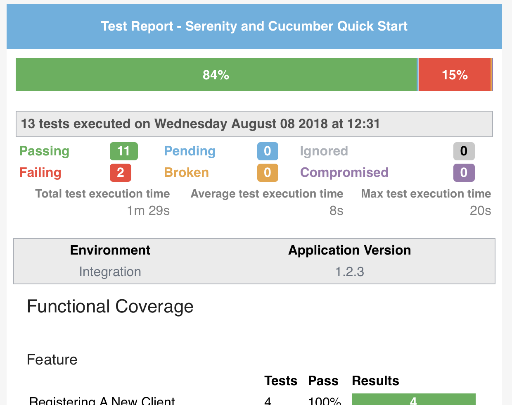
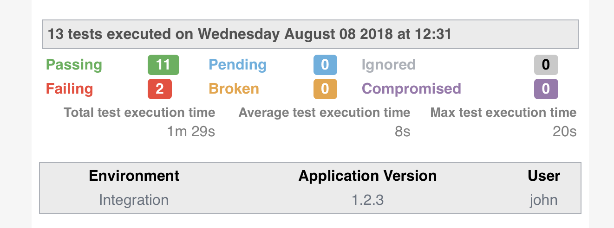
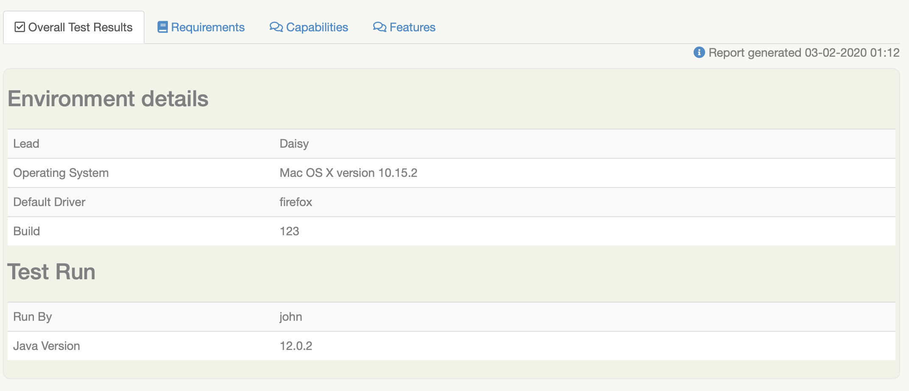

## Custom Field Reporting

Custom fields can be included in the reports, using values that are either taken from the environment variables or passed into the build via system properties. This can be useful if you want to include the product or build version, the environment the tests were run on, or the test run date.

You can add custom fields to your report by setting system properties with the special prefix `report.customfields`. These can go in your `serenity.properties` file in the root directory of your project, or you can pass them in as command-line options.

For example, you could add the following properties to your `serenity.properties` file.
```
report.customfields.environment = Integration
report.customfields.ApplicationVersion = 1.2.3
```

This would produce a report containing these values, as shown here:



### Accessing system variables
We can also access any system variables that Java has access to. For example, we could include the name of the user who ran the test run with the `${USER}` system variable:

```
report.customfields.user = ${USER}
```

This property would result in a report like the following:



Not all system properties are available to Java. For example, on Linux systems, the `$HOST` variable gives the name of the local machine. We could include this in our report by adding the following property:

```
report.customfields.host = ${HOST}
```

However, since this variable is not available to Java, we would need to pass it to Serenity from the command line, like this:

```bash
mvn serenity:aggregate -DHOST=$HOST
```

### Overriding property values

[[custom-report-fields-with-provided-values]]
.You can pass system properties from the command line
image::custom-reports-with-provided-property.png[]

You can of course pass in other properties, to override the ones in your `serenity.properties` file. Here we override the application version:

```bash
mvn serenity:aggregate -DHOST=$HOST -Dreport.customfields.ApplicationVersion=1.2.4
```
But a more elegant solution, if you know you will always be passing in a variable, is to use a shorter variable in your `serenity.properties` file and then pass this one in. For example, here we use the `environment` property to display the current environment in the custom properties:

```
report.customfields.environment = ${environment}
```

We can set this value from the command line as shown here:

```bash
mvn serenity:aggregate -DHOST=$HOST -Denvironment=INT5
```

### Ordering the custom properties

By default, the fields will appear in an arbitrary order. You can force the fields to appear in a pre-determined order using the `report.customfields.order` field:

```
report.customfields.order=ApplicationVersion,environment,user,host
```

### A complete example
A complete example of these properties and their various usages is shown here:

```
report.customfields.ApplicationVersion = 1.2.3
report.customfields.environment = ${environment}
report.customfields.user = ${USER}
report.customfields.host = ${HOST}
report.customfields.order=ApplicationVersion,environment,user,host
```

## Custom Build Info

You can also add your own fields the the Build Info screen, using the `sysinfo.*` properties.
The `sysinfo.*` properties let you define fields and values that will appear in the Build Info page. For simple field-value combinations, the field appears alongside the other values on the Build Info screen:

```
sysinfo.lead = Daisy
```

You can use Groovy expressions to access system properties (that you can pass in from the command line). The `env` property gives you access to the current environment variables. For example, to display the current Jenkins build number, you could include the following line:

```
sysinfo.build = "${env.BUILD_NUMBER}"
```

You can also group custom properties into sections with sub-titles. An example of such a configuration in the `serenity.conf` file is shown below:

```
sysinfo {
  lead = Daisy
  build = "${env.BUILD_NUMBER}"
  Test Run {
    Run By = "${env.USER}"
    Java Version = "${java.version}"
  }
}
```

The corresponding Build Info screen is shown below:

