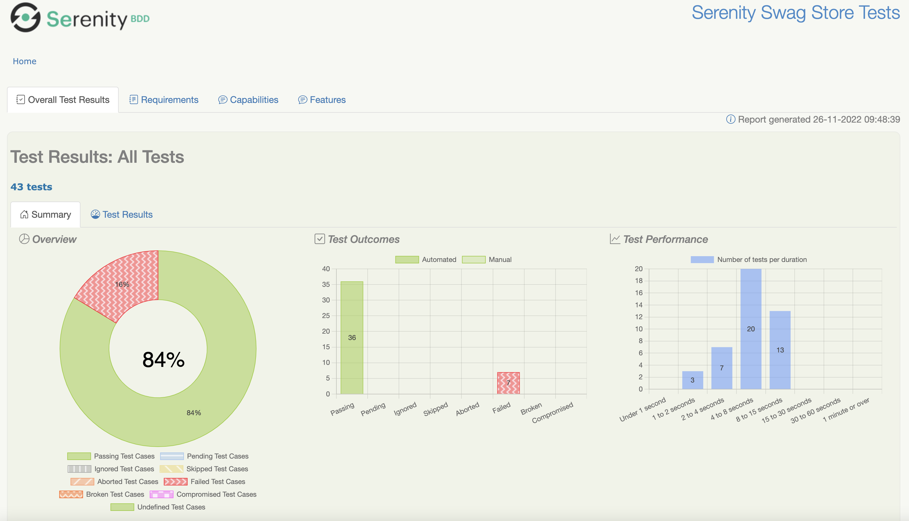
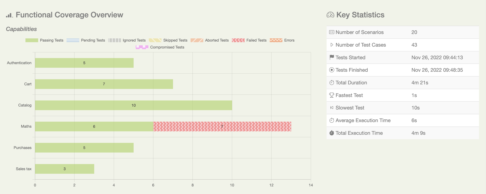
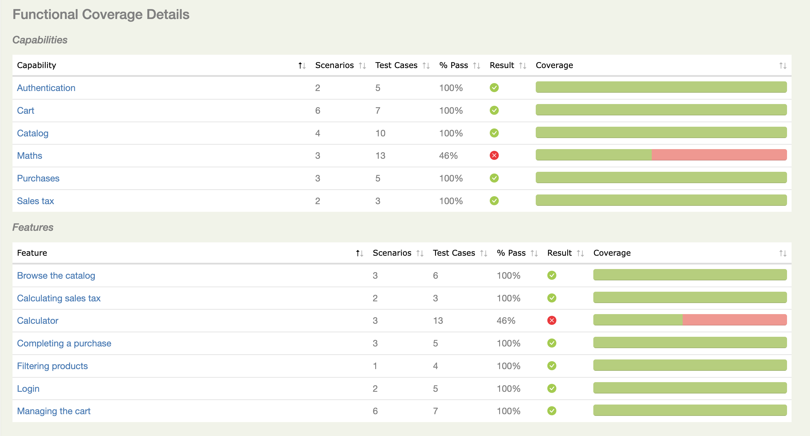

The Serenity reports are a particularly powerful feature of Serenity BDD. They aim not only to _report_ test results, but also to _document_ how features are tested, and what the application does. 

## An overview of the test results

A typical Serenity test report is shown below:



This shows a simple pie chart displaying the test result distribution, and bar charts indicating the test outcomes sorted by result and by test duration.

The squiggly lines in the orange bars (indicating broken tests) are for accessiblity. To activate these, you will need the following setting in your `serenity.conf` file:

```hocon
serenity {
    report {
       accessibility = true
    }
}
```

## Functional Test Coverage

Further down the screen you will find the Functional Test Coverage section:


This section gives a breakdown by capability (or by however you have decided to group your features). You can define the requirements types used in your project using the `serenity.requirement.types` property, e.g.

```hocon
serenity {
  requirement {
    types = "epic, feature"
  }
}
```
Note that for Cucumber, the lowest level will always be defined as _Feature_.

The _Key Statistics_ section shows execution times and the overall number of test scenarios and test cases. You can define the ranges of duration values that appear in the report using the `serenity.report.durations` property: 

```hocon
serenity{
  report {
    durations = "1,2,4,8,15,30,60"
  }
}
```

Serenity distinguishes between more general _Test Scenarios_, and more specific _Test Cases_.

A simple scenario or JUnit test counts as a scenario with a single test case. For example, consider the following scenario:

```gherkin
Scenario: Colin logs in with Colin's valid credentials
    Given Colin is on the login page
    When Colin logs in with valid credentials
    Then he should be presented the product catalog
```

This counts as 1 scenario with 1 test case.

| Scenarios | Test Cases |
|-----------|------------|
| 1         | 1          |

A scenario outline, on the other hand, is a single scenario with many test cases. So if you had the following scenario outline:

```gherkin
    Scenario Outline: Login's with invalid credentials for <username>
      Given Colin is on the login page
      When Colin attempts to login with the following credentials:
        | username   | password   |
        | <username> | <password> |
      Then he should be presented with the error message <message>
      Examples:
        | username        | password       | message                                                     |
        | standard_user   | wrong_password | Username and password do not match any user in this service |
        | unknown_user    | secret_sauce   | Username and password do not match any user in this service |
        | unknown_user    | wrong_password | Username and password do not match any user in this service |
        | locked_out_user | secret_sauce   | Sorry, this user has been locked out                        |
```

Then the test report would include 1 scenario but 4 test cases:

| Scenarios | Test Cases |
|-----------|------------|
| 1         | 4          |

So a test suite that contains both of these scenarios would include 2 scenarios made up of 5 test cases:

| Scenarios | Test Cases |
|-----------|------------|
| 2         | 5          |

## Functional Coverage Details

Further down the functional coverage results are displayed in more detail:



This lists the requirements by category. By default, Cucumber results organised in folders under `src/test/resources/features` will be organised by Capabilities and Features. As mentioned above, you can customise these categories using the `serenity.requirement.types` property. 


## Test Results

The Test Results tab lists the actual test results:


For data-driven tests and scenario outlines, each row of data is reported as a separate test result, and marked by a table icon to indicate that it is a data-driven test result. 

## Errors and Tags

The last section of the report lists the most frequent causes of test failures:


This section also mentions which the features containing the most failing tests. You can see which tests fail for a given reason by clicking on the corresponding _error_ tag just below this section.

It also lists the tags appearing in the features. You can exclude tags you don't want to appear in this section (for example, technical tags) using the `serenity.report.exclude.tags` property, e.g.
```
serenity {
    report {
        exclude.tags = "resetappstate,singlebrowser,manual"
    }
}
```


