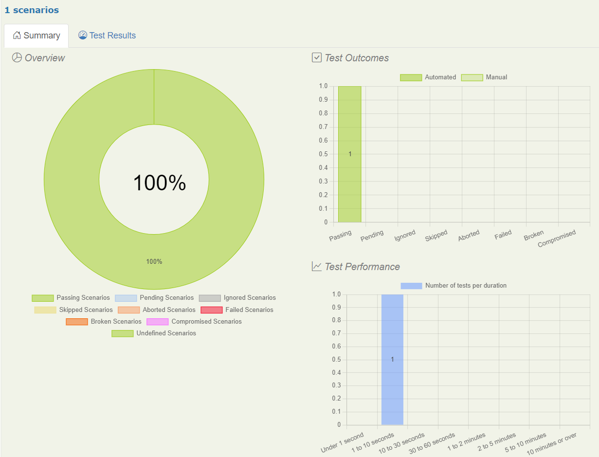
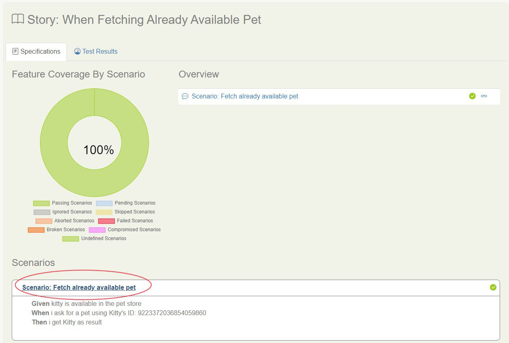
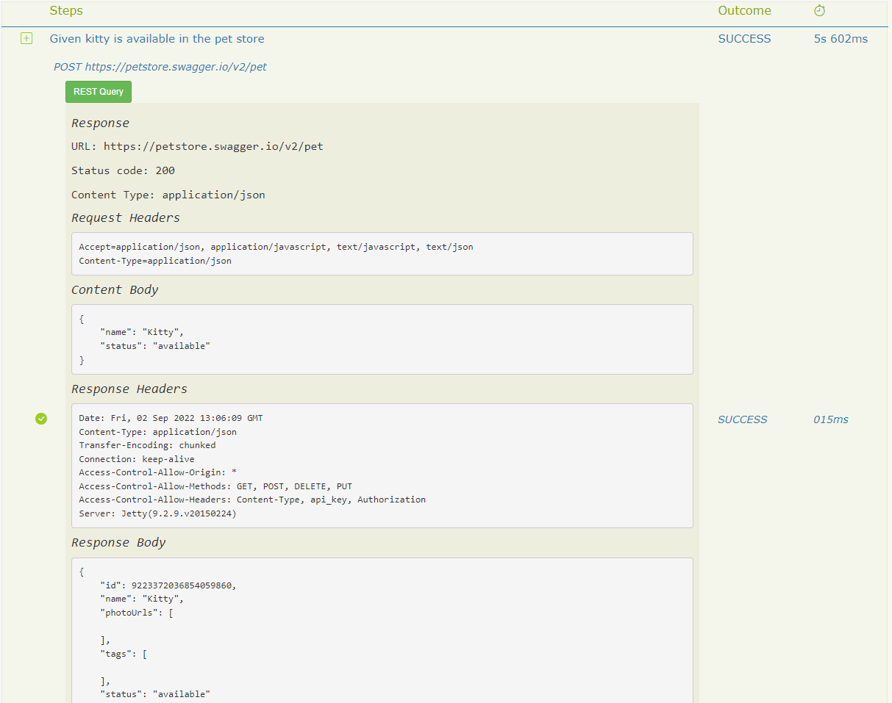

# Your First API Test

In the previous tutorial we looked at how to write a simple web test with Serenity BDD. But Serenity isn't just for web tests: Serenity BDD also provides tight integration with [Rest Assured](https://rest-assured.io/), a popular open source library for testing REST APIs.

## Pre-requisites
To run this tutorial, you will need a few things installed on your machine:
* **Java**: Serenity BDD is a Java library, so you'll need a recent JDK installed. JDK 1.8 or higher should be fine.
* **Maven**: You will need Maven 3 or higher installed in your computer.  This acts as a build tool that also downloads the dependencies while building.
* **A Java IDE**: You'll also need a Java Development Environment such as IntelliJ or Eclipse (and a working knowledge of Java).
* **Git**: We'll be using a starter project on Github, and the sample code for this project lives on Github too, so I'll be assuming you have a basic understanding of Git.

## Creating your project

We will be using the **[Serenity BDD Junit Starter](https://github.com/serenity-bdd/serenity-junit-starter)** template project to get a simple project up and running quickly.

This project comes with a sample test based on Junit 5 already implemented for our reference.  For now, we are going to ignore that and start writing a new test from scratch.

Go to the [project template page on Github](https://github.com/serenity-bdd/serenity-junit-starter) and click on [Use This Template](https://github.com/serenity-bdd/serenity-junit-starter/generate).

## Deleting the unnecessary files

Just to make sure that the starter template's sample files do not interfere with our experience in this tutorial, **delete** the `src/test/java/starter/wikipedia` directory.

## Adding the Serenity RestAssured Dependency

Open the `pom.xml` file in the root directory and add the following lines in the `<dependencies>` section, similar to the ones already in the file. 

```xml
 <dependency>
      <groupId>net.serenity-bdd</groupId>
      <artifactId>serenity-rest-assured</artifactId>
      <version>${serenity.version}</version>
      <scope>test</scope>
  </dependency>
```

## Enabling Detailed HTML reports
When we use the template's default configuration, we get only a single-page HTML report.  We want to generate a detailed HTML report in this tutorial.  So, let us **delete** the following line from the `pom.xml` file.

```xml
  <reports>single-page-html</reports>
  <!-- DELETE the line above. Yes, delete it! -->
```
You can find this in the configuration section of `serenity-maven-plugin` plugin.

## The project directory structure
We will use some simple conventions to organise our feature files and the supporting Java classes, based on the standard Maven project structure outlined below:

```
├───src
│   ├───main
│   │   └───java
│   │       └───starter
│   └───test
│       ├───java
│       │   └───starter
│       │       └───petstore
│       └───resources
```

Here are some points to note about the directory structure.
1. Since we will test the publicly available [Pet Store API](https://petstore.swagger.io/), we will not have any code in the `src/main` directory.
2. We will re-use (from the template) the contents that are already there in the `src/test/resources/` directory.
3. We will create a new directory `petstore` under `src/test/java/starter` directory to store our test class and its helpers.

## Writing an API test
Let us start with writing our API test.  In this test, we will test the [`GET /pet/{petId}`](https://petstore.swagger.io/#/pet/getPetById) API.  This API will return a pet when you give its `id` in the URL.

However, we cannot call this API directly without any `id`.  Hence, our test needs to first create a Pet and get its `id` before it calling the `GET /pet/{petId}` API end point.

In other words, we could write our test in the `Given-When-Then` format as follows.

```Gherkin
Given Kitty is available in the pet store
When I ask for a pet using Kitty's ID
Then I get Kitty as result
```

### Basic test structure

Now we create a new test class (let's call it `WhenFetchingAlreadyAvailablePet`), and an empty test case (we can call it `fetchAlreadyAvailablePet`).

```java
package starter.petstore;

import net.serenitybdd.junit5.SerenityJUnit5Extension;
import org.junit.jupiter.api.Test;
import org.junit.jupiter.api.extension.ExtendWith;


@ExtendWith(SerenityJUnit5Extension.class)
public class WhenFetchingAlreadyAvailablePet {

  @Test
  public void fetchAlreadyAvailablePet() {
    
  }
}
```

:::caution
There are a few things to note here:
- The `@ExtendWith` annotation tells JUnit that this test uses Serenity - don't forget this annotation or your test won't be recognised as a Serenity test
- The `@Test` annotation uses the `org.junit.jupiter.api.Test` class, from JUnit 5. Be careful not to get this mixed up with the JUnit 4 annotation of the same name (`org.junit.Test`), otherwise your test won't run.
- Note that the name of the test class starts with `When`.  This is one of the ways to make sure it is recognized as a test to be run in the Maven build process.  See the `pom.xml` file's `configuration` section for `maven-failsafe-plugin` for more details on this.

:::

### Creating Action Classes

We could simply start writing the entire test's code inside our `fetchAlreadyAvailablePet()` method. That would work fine. But keeping your test code well organised and well-structured is essential to keeping maintenance costs down. And Serenity BDD gives us a number of ways to do this.

One of the simplest ways to do this is called _Action Classes_. Action Classes are small, reusable classes with methods that encapsulate key user actions.  We will use these classes to call the HTTP APIs.

For example, we could break our `fetchAlreadyAvailablePet()` test down into three steps:
1. **Arrange (Given):** Set the stage to call the GET api by pre-loading the pet named 'Kitty' using a HTTP POST call documented [here](https://petstore.swagger.io/#/pet/addPet).
2. **Act (When):** Call the API under test using the ID of 'Kitty'
3. **Assert (Then):** Check that the API returns a pet with name 'Kitty'

Let us create an action class named `PetApiActions` with the following skeleton code, in the same `petstore` package where the test lives.

```java
package starter.petstore;

import io.cucumber.java.en.Given;
import io.cucumber.java.en.Then;
import io.cucumber.java.en.When;
import net.serenitybdd.core.steps.UIInteractions;


public class PetApiActions extends UIInteractions {

    @Given("Kitty is available in the pet store")
    public Long givenKittyIsAvailableInPetStore() {
              
    }

    @When("I ask for a pet using Kitty's ID: {0}")
    public void whenIAskForAPetWithId(Long id) {
        
    }

    @Then("I get Kitty as result")
    public void thenISeeKittyAsResult() {
       
    }
}

```

:::caution

**Points to note**
1. Since we want to use the ID generated by the API in our upcoming step, we return the ID as a Long return value.
2. We extend the `UIInteractions` class that comes with the Serenity BDD to help us interact with APIs.

:::

Let's start with implementing the first action: Setting the stage by pre-creating a pet with name `"Kitty"` by calling the POST API.

Since we need to create a Java object to hold the `Pet`, we can create a class `Pet.java` under `starter.petstore` package with the following code.

```java
package starter.petstore;

public class Pet {
    private String name;
    private String status;
    private Long id;

    public Pet(String name, String status, Long id) {
        this.name = name;
        this.status = status;
        this.id = id;
    }

    public Pet(String name, String status) {
        this.name = name;
        this.status = status;
    }

    public String getName() {
        return this.name;
    }

    public String getStatus() {
        return this.status;
    }

    public Long getId() {
        return id;
    }

    public void setName(String name) {
        this.name = name;
    }

    public void setStatus(String status) {
        this.status = status;
    }

    public void setId(Long id) {
        this.id = id;
    }
}
```

Now that we have a way to represent a Pet in our code, let us write our first action in function `givenKittyIsAvailableInPetStore()`  of the class `PetApiActions`.

```java
package starter.petstore;

import io.cucumber.java.en.Given;
import io.cucumber.java.en.Then;
import io.cucumber.java.en.When;
import io.restassured.http.ContentType;
import io.restassured.mapper.ObjectMapperType;
import net.serenitybdd.core.steps.UIInteractions;


import static net.serenitybdd.rest.SerenityRest.*;

public class PetApiActions extends UIInteractions {

    @Given("Kitty is available in the pet store")
    public Long givenKittyIsAvailableInPetStore() {

        Pet pet = new Pet("Kitty", "available");

        Long newId = given()
                .baseUri("https://petstore.swagger.io")
                .basePath("/v2/pet")
                .body(pet, ObjectMapperType.GSON)
                .accept(ContentType.JSON)
                .contentType(ContentType.JSON).post().getBody().as(Pet.class, ObjectMapperType.GSON).getId();
        return newId;
    }

    @When("I ask for a pet using Kitty's ID: {0}")
    public void whenIAskForAPetWithId(Long id) {

    }

    @Then("I get Kitty as result")
    public void thenISeeKittyAsResult() {

    }
}

```

Next, let us write the implementation for the `whenIAskForAPetWithId` function.  This will include just calling the GET API that needs to be tested.

```java
    @When("I ask for a pet using Kitty's ID: {0}")
    public void whenIAskForAPetWithId(Long id) {
        when().get("/" + id);
    }
```
:::caution

**Points to note**
1. In the `get` method call above, the `baseUri` and `basePath` from the `given()` section is reused.  This is why you did not have to repeat those details in this method.
2. Since we are using the `id` as an input parameter, we are using `{0}` in the description so that it can appear in our reports.   
:::

Next, let us write the implementation for the `thenISeeKittyAsResult` method as follows.

```java
    @Then("I get Kitty as result")
    public void thenISeeKittyAsResult() {
        then().body("name", Matchers.equalTo("Kitty"));
    }

```

Putting everything together, the `PetApiActions.java` file looks as follows.

```java
package starter.petstore;

import io.cucumber.java.en.Given;
import io.cucumber.java.en.Then;
import io.cucumber.java.en.When;
import io.restassured.http.ContentType;
import io.restassured.mapper.ObjectMapperType;
import net.serenitybdd.core.steps.UIInteractions;
import org.hamcrest.Matchers;

import static net.serenitybdd.rest.SerenityRest.*;

public class PetApiActions extends UIInteractions {

    @Given("Kitty is available in the pet store")
    public Long givenKittyIsAvailableInPetStore() {

        Pet pet = new Pet("Kitty", "available");

        Long newId = given()
                .baseUri("https://petstore.swagger.io")
                .basePath("/v2/pet")
                .body(pet, ObjectMapperType.GSON)
                .accept(ContentType.JSON)
                .contentType(ContentType.JSON).post().getBody().as(Pet.class, ObjectMapperType.GSON).getId();
        return newId;
    }

    @When("I ask for a pet using Kitty's ID: {0}")
    public void whenIAskForAPetWithId(Long id) {
        when().get("/" + id);
    }

    @Then("I get Kitty as result")
    public void thenISeeKittyAsResult() {
        then().body("name", Matchers.equalTo("Kitty"));
    }

}


```

### Completing our test case

Now that we have our Actions class ready, let us finish writing our test case in the `WhenFetchingAlreadyAvailablePet` class.

```java
package starter.petstore;

import net.serenitybdd.junit5.SerenityJUnit5Extension;
import org.junit.jupiter.api.Test;
import org.junit.jupiter.api.extension.ExtendWith;

@ExtendWith(SerenityJUnit5Extension.class)
public class WhenFetchingAlreadyAvailablePet {

    Long newPetId = null;
    PetApiActions petApi;

    @Test
    public void fetchAlreadyAvailablePet() {
        newPetId = petApi.givenKittyIsAvailableInPetStore();
        petApi.whenIAskForAPetWithId(newPetId);
        petApi.thenISeeKittyAsResult();
    }
}
```

Let us try running the Maven build to see the result.  If the API works as expected, we expect the test to pass and a detailed HTML report to be generated.

Run the following command in a terminal or command prompt.

```bash
mvn clean verify
```

Once the command completes, you can see output similar to the following.

```
[INFO] Tests run: 1, Failures: 0, Errors: 0, Skipped: 0, Time elapsed: 10.009 s - in starter.petstore.WhenFetchingAlreadyAvailablePet
[INFO] 
[INFO] Results:
[INFO]
[INFO] Tests run: 1, Failures: 0, Errors: 0, Skipped: 0

...
...
...

[INFO] -----------------------------------------
[INFO]  SERENITY TESTS: SUCCESS
[INFO] -----------------------------------------
[INFO] | Test cases executed    | 1
[INFO] | Tests executed         | 1
[INFO] | Tests passed           | 1
[INFO] | Tests failed           | 0
[INFO] | Tests with errors      | 0
[INFO] | Tests compromised      | 0
[INFO] | Tests aborted          | 0
[INFO] | Tests pending          | 0
[INFO] | Tests ignored/skipped  | 0
[INFO] ------------------------ | --------------
[INFO] | Total Duration         | 9s 212ms
[INFO] | Fastest test took      | 9s 212ms
[INFO] | Slowest test took      | 9s 212ms
[INFO] -----------------------------------------
[INFO]
[INFO] SERENITY REPORTS
[INFO]   - Full Report: file:///C:/Users/calib/source-codes/temp/serenity-junit-starter/target/site/serenity/index.html
[INFO]
[INFO] --- maven-failsafe-plugin:3.0.0-M5:verify (default) @ serenity-junit-starter ---
[INFO] ------------------------------------------------------------------------
[INFO] BUILD SUCCESS
[INFO] ------------------------------------------------------------------------
[INFO] Total time:  39.104 s
[INFO] Finished at: 2022-09-02T17:33:14+05:30
[INFO] ------------------------------------------------------------------------

```

Yes, the test passed and the build is successful now.  We have managed to test our API successfully 🎉

## Reporting and Living Documentation

If you notice carefully, the output of the `mvn clean verify` command informed us that a report is created in `target/site/serenity/index.html`

When you open this file in a web browser, you see a beautiful report like this.



You can also find the test-wise results detailing the steps in the `Stories` tab, detailing the REST API calls.



If you want to look at the exact details used in the HTTP requests, you can click on the link circled in the above screenshot.  This will show you the details as shown below.



Feel free to navigate the links in this report and look around.

## Conclusion
In this tutorial, you created your own API test cases and ran them using Serenity BDD to generate a beautiful report.
